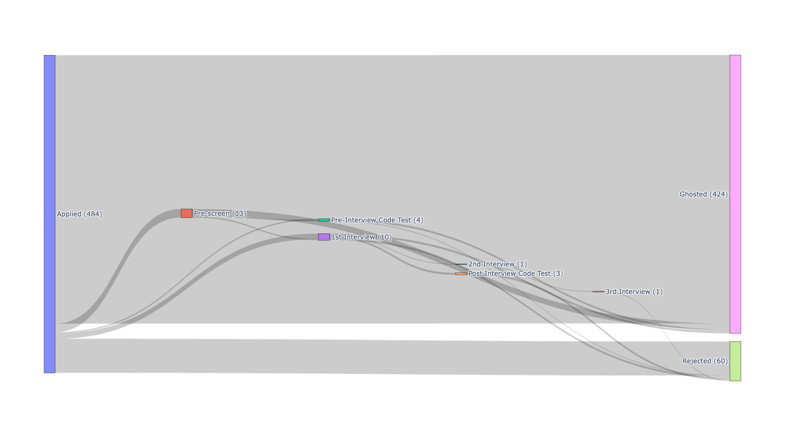

# job_search_sankey_diagram
Python code that generates a Sankey Diagram from my job search spreadsheet.

## ChatGPT
I had `ChatGPT 4o` generate this code with the following prompts.

### Turn 1:

```
Write code to turn this into a Sankey Diagram. Use the following nodes from left to right:

Applied
Pre-screen
1st Interview
2nd Interview
3rd Interview
Rejected/Ghosted

Don't worry about dates in regard to the nodes. Only graph the flow from one state to another. Consider an application ghosted if there is no rejection date. Consider it rejected if there is a rejection date.
```

### Turn 2:

```
Make rejected and ghosted two separate final states. Also, label each state with the number of applications in the state.
```

## Run

To run the code, view the `README.md` in the `python` directory.

## Output


